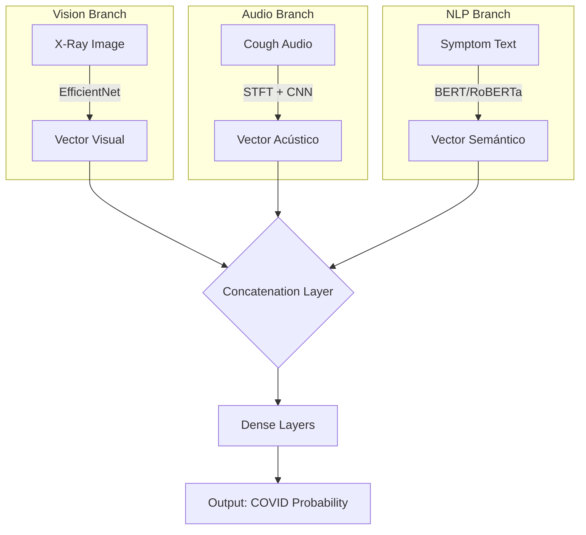

# 🦠 Tri-Modal COVID-19 Diagnosis: Vision, Audio & Language (WIP)

> **Proyecto de Investigación Avanzada:** Arquitectura Trimodal que integra Radiografías, Biomarcadores Acústicos (Tos) y Narrativa Clínica.

-yellow?style=flat-square&logo=git)

-blue?style=flat-square)

## 🔭 Visión y Desafío
El diagnóstico médico humano es inherentemente multimodal. Un médico no solo mira una radiografía; también **escucha** la tos del paciente e **interpreta** su relato de síntomas.

Este proyecto busca replicar ese proceso holístico mediante una arquitectura de Deep Learning de **fusión tardía** que integra tres fuentes de datos disjuntas:
1.  **Visión (Image):** Rayos X de Tórax (Detección de neumonía/vidrio esmerilado).
2.  **Audio (Signal):** Grabaciones de tos forzada (Análisis espectral de frecuencias).
3.  **Lenguaje (NLP):** Diálogos paciente-médico (Análisis semántico de síntomas).

## ⚙️ Metodología Definida (Pipeline)

El proyecto sigue una metodología rigurosa documentada en el notebook principal (`lab_03_IA.ipynb`), estructurada en tres fases críticas:

### 1. Fase de Texto: Generación Sintética con LLMs 🤖
* **Problema:** Escasez de datasets públicos con transcripciones reales de anamnesis (entrevistas clínicas) de COVID-19.
* **Solución Innovadora:** Implementación de un pipeline de **Generación de Datos Sintéticos** utilizando APIs de LLMs (Large Language Models).
* **Ingeniería del Script:**
    * **Batch Processing:** Generación iterativa de diálogos con manejo de `rate limits` (pausas estratégicas para no saturar la API).
    * **Prompt Engineering:** Diseño de prompts para simular variaciones lingüísticas (pacientes ansiosos, descriptivos, breves).
    * **Class Balancing:** Control programático para asegurar un 50/50 de casos Positivos/Negativos en el CSV de salida.
    * **Persistencia:** Guardado automático y barajado (`shuffle`) del dataset para evitar sesgos de orden.

### 2. Fase de Audio: Procesamiento Espectral 🎤
* **Fuente:** Datasets de investigación acústica (Coswara/DiCOVA).
* **Técnica:** Transformación de audio raw (`.wav`) a representaciones visuales mediante **Mel-Spectrograms**.
* **Objetivo:** Convertir el problema de audio en un problema de visión, permitiendo el uso de CNNs (como ResNet o VGGish) para detectar patrones inaudibles al oído humano.

### 3. Fase de Fusión: Arquitectura Trimodal 🧠
Diseño de una red neuronal de tres ramas independientes que convergen en una capa densa final:

## 🚧 Estado del Desarrollo (Roadmap)
El notebook documenta el progreso actual del sistema:

[x] Definición de Arquitectura: Diseño conceptual de las 3 ramas y estrategia de fusión.

[x] Pipeline de NLP: Script de generación de datos sintéticos completado, funcional y capaz de crear datasets balanceados.

[ ] Pipeline de Audio: Implementación de la conversión a Mel-Spectrograms (En proceso).

[ ] Entrenamiento: Configuración del loop de entrenamiento y validación cruzada.

## 🛠️ Stack Tecnológico
Generative AI: LLM APIs para Data Augmentation.

Deep Learning: PyTorch / TensorFlow (Soporte GPU T4 habilitado).

Audio Processing: Librosa (Extracción de características espectrales).

NLP: Hugging Face Transformers (Tokenización).

Data Ops: Pandas, Tqdm (Control de progreso).

👥 Créditos
Investigación desarrollada para el curso de especialización en Inteligencia Artificial (EFE) - Univerisidad Tecnológica Metropolitana .

Patricio Abarca - https://github.com/Begluckt
Rodrigo Tapia - https://github.com/Chucaflu11
